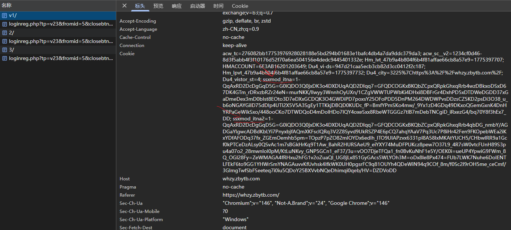
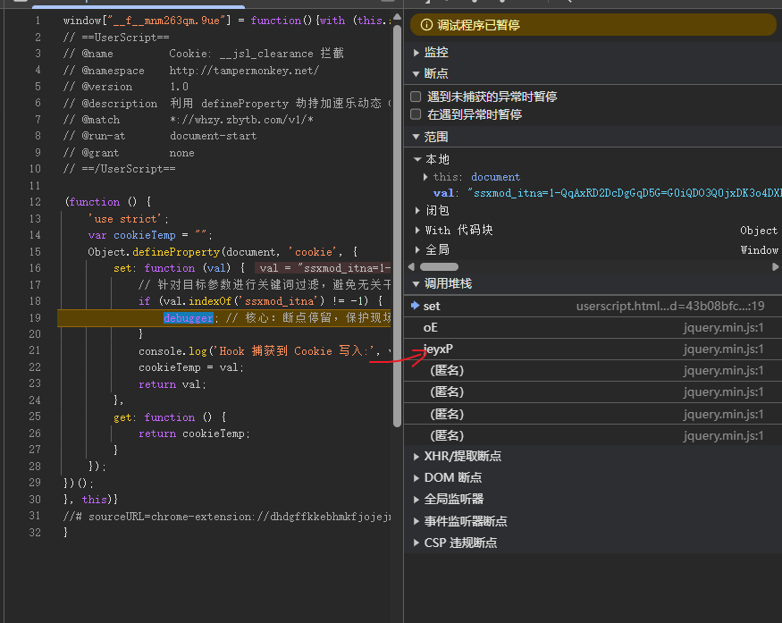
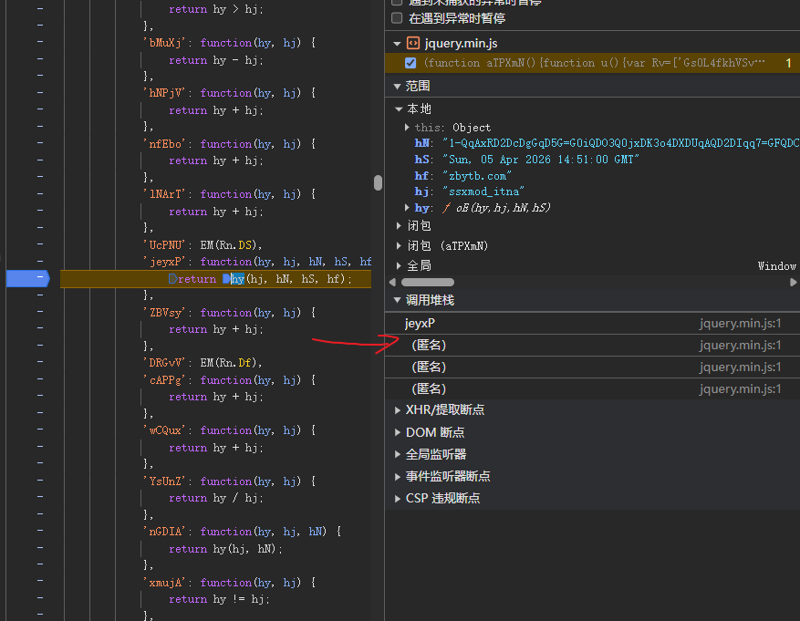

# 某公共资源交易平台 

## 1. 架构引言：本地存储层防线与属性访问器劫持

在 Web 逆向工程中，并非所有核心加密参数都依附于 XHR/Fetch 的 `Headers` 或 `Payload`。面对企业级 WAF（如加速乐、瑞数、Akamai 等）或采用全页刷新的传统架构，服务端往往通过动态脚本生成高强度的指纹密文，并将其静默写入 `document.cookie` 中，用于后续请求的合法性校验。

### 1.1 防护架构分析：页面级刷新与静默写入
常规的 XHR 断点在面对这种架构时会彻底失效。因为 Cookie 的计算和写入发生在 HTML 解析的最早期（Head 段脚本自执行），当我们在 Network 面板看到请求发出时，Cookie 早已生成完毕。这种“快闪式”的写入机制，构成了本地存储层的第一道防线。

### 1.2 核心痛点：寻找“案发第一现场”
浏览器的开发者工具并没有提供原生的“Cookie 写入断点”（只能监听存储面板的变化，但无法阻断代码执行流）。如果我们直接在庞大的 JS 文件中搜索 Cookie 键名，往往会陷入无限的 `switch-case` 混淆迷宫中。

### 1.3 核心战术：底层原生 API 劫持（Hook `document.cookie`）
如同我们在收包层劫持 `JSON.parse` 一样，发包层的终极拦截武器是 **`Object.defineProperty`**。
`document.cookie` 并非简单的字符串，而是挂载在 `HTMLDocument.prototype` 上的访问器属性（Accessor Property）。我们可以利用 Tampermonkey 在 `document-start` 阶段重写其底层的 `set` 方法，一旦匹配到目标 Cookie 键名被赋值，立刻触发 `debugger`，强行冻结执行流。

## 2. 目标接口与抓包分析

*(图：抓包分析，定位动态指纹 Cookie)*

* **交互特征:** 点击分页导航时，页面发生整体跳转刷新。
* **加密特征:** 请求 Header 中携带了高频变动的高熵长字符串 Cookie：`ssxmod_itna=1-QqAxRD2...`。
* **架构研判:** 结合响应体中缺乏对应的 `Set-Cookie` 头，断定该字段是由前端 JS 收集浏览器环境指纹后，动态加密并写入本地存储的 WAF 令牌。

## 3. 逆向定位过程

### 3.1 使用油猴 Hook `document.cookie`

编写专用探针脚本，在页面加载极早期注入。设置关键词 `ssxmod_itna` 进行精准拦截，过滤掉无关的分析统计 Cookie。

    javascript
    // ==UserScript==
    // @name         动态 Cookie 拦截器 (Target: ssxmod_itna)
    // @match        *://*[.example-target.com/](https://.example-target.com/)* // [!脱敏] 替换为目标网站的泛域名
    // @run-at       document-start
    // ==/UserScript==
    
    (function () {
        'use strict';
        var cookieTemp = "";
        Object.defineProperty(document, 'cookie', {
            set: function (val) {
                if (val.indexOf('ssxmod_itna') != -1) {
                    console.log('🔥 拦截到核心 Cookie 写入:', val);
                    debugger; // 强行阻断，保护现场
                }
                cookieTemp = val;
                return val;
            },
            get: function () { return cookieTemp; }
        });
    })();
    (图：脚本成功阻断代码执行流，进入案发现场)
    
    刷新页面，代码毫无悬念地在我们埋下的 debugger 处停下。此时，内存变量 val 中已经装载了完整的加密 Cookie 值。

### 3.2 追溯调用堆栈 (Call Stack) 与避开“伪装陷阱”

这是本次实战中最容易踩坑的环节：

遭遇“障眼法”： 观察右侧 Call Stack，从 set 回溯，依次经过了 oE -> jeyxP 等栈帧。令人迷惑的是，它们所在的文件名居然叫 jquery.min.js。

识破伪装： 真正的标准库是不会包含如此高强度的 OB 混淆（Obfuscator）字典分发器的。这是一个被刻意重命名为第三方库的核心加密分发文件。

完成溯源跨越： 由于 jeyxP 这一层只是个参数传递中转站（密文在传入时已经生成完毕），我们必须如图 03 中的红色箭头所示，向下点击第一个 (匿名) 函数栈帧。这一步操作如同穿透了重重迷雾，直接跳回了生成这段密文的真正业务逻辑入口。

## 4. 架构复盘与下一阶段预告：高维度的降维打击
经过模块 02 的层层推进，我们已经彻底掌握了从请求头、响应体到本地存储层的全链路参数定位体系。到目前为止，我们都能精准找到加密逻辑的“案发第一现场”。

但是，找到现场不等于能够破案。

当我们顺着图 03 的调用栈继续深入，试图寻找类似前几节中清晰的 AES.encrypt 时，迎面而来的却是：

疯狂的浏览器指纹采集（Canvas、WebGL、WebRTC）。

高度变异的 AST 控制流平坦化（满屏的十六进制算术运算与 switch-case）。

自研的密码学黑盒（如代码中遇到的 oK['c'](...) 运算函数）。

面对这种级别的企业级综合防护，传统的“扣代码、改改变量”的纯手动单步调试战术将彻底失效，极易陷入逻辑死锁。

## 下阶段预告：『03_算法与密码学破解』

不要在低维度的手动调试中消耗精力。从下一模块开始，我们将正式引入现代 Web 逆向的“降维武器”：

标准与魔改算法识别： 学习如何通过“魔法常数”一眼识破隐藏在混淆代码中的 MD5/SHA/AES 家族。

AST（抽象语法树）反混淆： 编写脚本，让机器自动还原那些恶心的十六进制变量和字典分发，让乱码重见天日。

纯净补环境框架 (Proxy 代理)： 不再痛苦地逆向分析它的环境检测逻辑，而是利用 Node.js 伪造一个完美的浏览器环境，让混淆代码“自投罗网”主动吐出我们要的密文！
