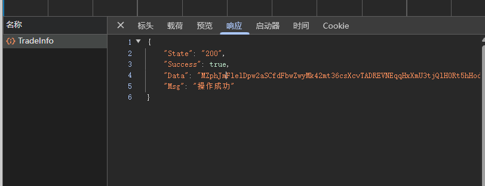
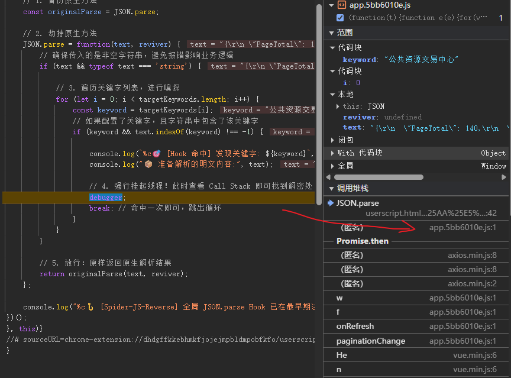
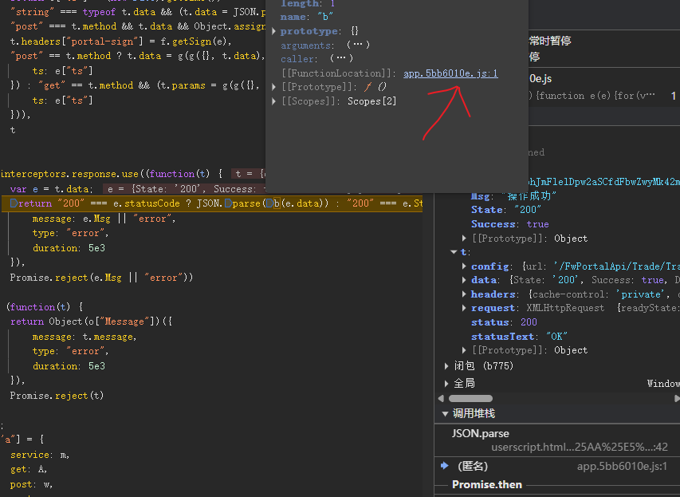

# 某省公共资源交易平台

## 1. 架构引言：收包层解密闭环与 JSON 解析劫持

在数据高度敏感的业务场景中（如政务公开、招投标数据），仅仅依靠网络传输层的加密（如 TLS/HTTPS）是不够的。一旦数据到达客户端，任何使用抓包工具的中间人都可以轻易截获明文。因此，服务端通常会在业务层对核心数据进行二次对称加密（如 AES），将密文作为 HTTP 响应体返回，再由前端 JS 进行解密渲染。

### 1.1 防护架构分析：响应拦截器 (Response Interceptor)
数据从服务端流向 Vue 等前端组件的视图层，必须经过反序列化的过程。标准的解密架构是：服务端返回密文 -> 浏览器原生网络 API 接收 -> **Axios 响应拦截器拦截数据** -> 执行解密算法还原明文 -> 调用 `JSON.parse` 将字符串转为 JS 对象 -> 交付给前端组件进行数据绑定。

### 1.2 核心痛点：局部作用域的深层嵌套
面对密文响应，如果我们直接去阅读前端压缩后的 JS 文件寻找解密逻辑，无异于大海捞针。解密算法的核心要素（如 AES 的 Key 和 IV），往往被封装在极深的回调函数或 Webpack 的私有闭包内部，外部全局环境根本无法访问，这就是所谓的“局部作用域壁垒”。

### 1.3 核心战术：底层原生 API 劫持（Hook `JSON.parse`）
面对收包层的复杂解密，最优雅的战术是**“扼守咽喉要道”**。
无论中间的解密逻辑多么复杂、混淆多么严重，最终的明文数据在交付给页面渲染之前，大概率都要经过 JavaScript 引擎原生的 `JSON.parse` 方法进行解析。
* 我们利用 `Tampermonkey` (油猴脚本) 在网页生命周期的最早期（`document-start`），强行替换浏览器原生的 `JSON.parse`。
* 设定“诱饵”（即页面上可见的明文字段），一旦被重写的 `JSON.parse` 捕获到这串明文，立即触发 `debugger`。此时，我们就在解密完成的“案发第一现场”拉起了警戒线，通过回溯调用栈，就能轻易揪出幕后的解密算法与密钥。

### 1.4 底层原理解析：词法作用域 (Scope) 与闭包 (Closure) 穿透
在成功 Hook 到解密现场后，很多人会死在“拿不到密钥”这一步。这要求我们必须深入理解 V8 引擎的作用域机制：

* **词法作用域与 Webpack 模块化：** 现代前端工程通过 Webpack 打包时，为了防止全局变量污染，会将每个模块的代码包裹在一个个独立的函数作用域中。这意味着核心的加密解密模块对外是“不可见”的。
  
* **闭包 (Closure) 导致的变量隔离：** 解密操作（如 `AES.decrypt`）往往在一个闭包内部运行。它所依赖的加密密钥（Key）和偏移量（IV）作为局部变量，死死地锁在这个闭包的执行上下文（Execution Context）中。
  
* **V8 引擎层面的上下文切换：** 当我们的全局油猴脚本 Hook 触发 `debugger` 时，控制台默认处于“全局执行上下文”。此时如果你直接在控制台敲击局部变量名尝试打印密钥，浏览器必然会抛出 `ReferenceError: x is not defined`。
  **破局原理：** Chrome DevTools 的 Call Stack（调用栈）面板不仅仅是一个历史记录，它更是 V8 引擎暴露给我们的**上下文切换器**。通过点击调用栈中特定的栈帧（Stack Frame），我们可以强制浏览器将执行上下文切换回那个历史闭包中，从而实现对局部加密密钥的“降维提取”。

## 1. 目标接口与抓包分析

* **目标接口:** 列表查询数据接口 (如 `/business/list`)
* **请求方式:** `POST`
* **加密特征:** 服务器返回的 JSON 响应体中，核心数据存放在 `Data` 字段，其值为一段高熵的 Base64 密文字符串，导致无法直接提取标段信息。前端页面上却能正常显示明文。

## 2. 逆向定位过程

### 2.1使用油猴 Hook `JSON.parse`

使用 Tampermonkey 在网页生命周期的极早期 (`document-start`) 注入以下代码，强行劫持并重写全局的 `JSON.parse` 方法。利用页面上可见的明文（如“公共资源交易中心”）作为诱饵进行拦截。

    javascript
    // ==UserScript==
    // @name         通用 JSON.parse 拦截器
    // @match        *://*[.example-target.com/](https://.example-target.com/)* // [!脱敏] 替换为目标网站的泛域名
    // @run-at       document-start
    // ==/UserScript==
    
    (function() {
        const originalParse = JSON.parse;
        JSON.parse = function(text, reviver) {
            if (text && typeof text === 'string' && text.indexOf('公共资源交易中心') !== -1) {
                console.log("🔥 拦截到关键明文解析");
                debugger; // 强行冻结执行流
            }
            return originalParse(text, reviver);
        };
    })();
### 2.3 追溯调用堆栈 (Call Stack)

刷新页面重新触发网络请求，代码成功在 Hook 函数内断住。
展开右侧的 Call Stack (调用堆栈)，向下回溯一层（跳出我们的油猴脚本），瞬间穿透底层框架，精准降落到真实的业务解密现场——Axios 响应拦截器：

    JavaScript
    // 响应拦截器核心逻辑
    return "200" === e.statusCode 
        ? JSON.parse(b(e.data)) 
        : "200" === e.State 
            ? JSON.parse(b(e.Data)) // ⬅️ 目标密文 e.Data 被传入 b()，解密后喂给 JSON.parse
            : (Object(o["Message"])...)
### 3. 加密算法破解

单步进入发现的核心解密函数 b(t)，进行代码格式化后，提取出底层解密逻辑：

    JavaScript
    function b(t) {
        var e = h.a.enc.Utf8.parse(r["e"])
          , n = h.a.enc.Utf8.parse(r["i"])
          , a = h.a.AES.decrypt(t, e, {
            iv: n,
            mode: h.a.mode.CBC,
            padding: h.a.pad.Pkcs7
        });
        return a.toString(h.a.enc.Utf8)
    }
**3.1 识别算法特征**
    代码虽然经过混淆，但暴露了极具辨识度的 crypto-js 标准库调用特征：
    
    模式与填充: 明确指出了 mode.CBC 和 pad.Pkcs7。
    算法确认: 调用了 AES.decrypt，确认为标准 AES-CBC 对称加密，无底层逻辑魔改。

**3.2 突破闭包，缴获 Key 与 IV (踩坑点)**
    踩坑记录： 在 Hook 触发的 debugger 状态下，若直接在控制台执行 r["e"] 获取密钥，系统会抛出 ReferenceError: r is not defined。这是因为当前控制台的作用域停留在了全局 Hook 函数中，无法穿透 Webpack 的局部闭包。
    
    破局方法： 在右侧 Call Stack 面板，鼠标单击属于 b 函数的那一层栈帧，强制切换执行上下文。
    此时重新在控制台输入 r["e"] 和 r["i"]，成功缴获硬编码的明文密钥对：
    Key: ****** (出于安全合规要求，已遮挡字符) 
    IV: ****** (出于安全合规要求，已遮挡字符)

## 4. Python 还原代码
    请参考 ../../02_实战代码/response.py