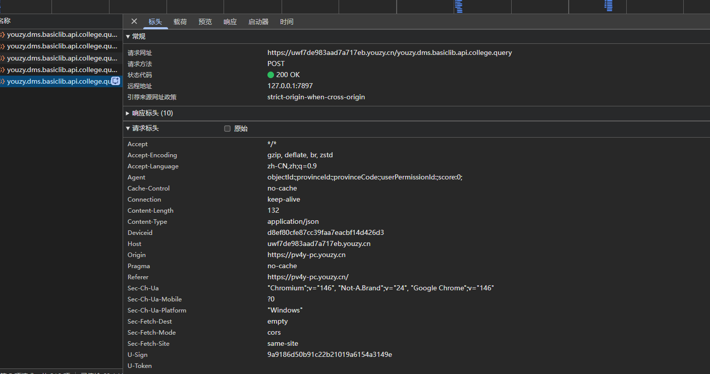
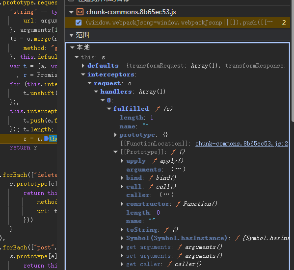

# 某高校数据查询平台 U-Sign 参数逆向分析

## 1. 目标接口与抓包分析
* **目标接口:** `/search/colleges/collegeList`
* **请求方式:** `POST`
* **加密特征:** 请求头中包含动态签名字段 `U-Sign`，如果不带或错误，接口返回拦截提示。

## 2. 逆向定位过程

### 2.1 尝试全局搜索（踩坑）
初步尝试全局搜索 `"u-sign"` 关键字，成功定位到目标 JS 文件。但由于 Webpack 打包导致单行代码过长，断点落在 `2:36023` 处无法正常断住，此路不通。

### 2.2 追溯调用堆栈 (Call Stack)
转换思路，从 Network 面板的 Initiator 入手。发现堆栈中存在 `Promise.then` 异步断层。

通过在 `s.request` 和底层 `e.exports` 之间下断点观察 Scope (作用域)，确认签名的生成发生在 Axios 的请求拦截器中。

### 2.3 深入请求拦截器
展开 `s.request` 断点处的 `interceptors.request.handlers`，跳转至 `fulfilled` 函数，成功捕获到核心加密逻辑入口：
`"u-sign": i(e.url, e.data)`

### 2.4 进阶战术：使用油猴 Hook 强制拦截 (应对极度混淆与异步断层)

**应用场景：** 当项目的 `Initiator` 调用堆栈被 `setTimeout` 或复杂微任务彻底切断，或者底层发包逻辑被高度混淆（全为单字母匿名函数），导致无法通过正向“顺藤摸瓜”找到拦截器时，必须采用底层的 Hook 战术进行逆向推导。

**1. 编写与注入 Hook 脚本：**
使用 Tampermonkey（油猴插件）在网页生命周期极早期 (`document-start`) 注入以下代码，强行劫持浏览器的原生 `XMLHttpRequest`。

javascript
// ==UserScript==
// @name         XHR U-Sign 万能拦截器
// @match        *://*.youzy.cn/*
// @run-at       document-start
// ==/UserScript==

(function() {
    var originalSetRequestHeader = XMLHttpRequest.prototype.setRequestHeader;
    XMLHttpRequest.prototype.setRequestHeader = function(key, value) {
        if (key.toLowerCase() === 'u-sign') {
            console.log("🔥 拦截到关键请求头赋值: ", key, "=", value);
            debugger; // 强行冻结执行流
        }
        return originalSetRequestHeader.apply(this, arguments);
    };
})();

## 3. 加密算法破解

单步进入 `i` 函数，提取出底层的拼接逻辑和加密算法：
        e.exports = function(e, t) {
            var r, o = "YOUR_SALT_HERE_***", i = "", a = t || {}, s = (e = e || "").split("?");//# 声明：盐值出于安全合规考虑已脱敏，请通过学习 README 中的逆向思路自行获取
            if (s.length > 0 && (r = s[1]),
            r) {
                var u = r.split("&")
                  , c = "";
                u.forEach(function(e) {
                    var t = e.split("=");
                    c += "".concat(t[0], "=").concat(encodeURI(t[1]), "&")
                }),
                i = "".concat(_.trimEnd(c, "&"), "&").concat(o)
            } else
                i = Object.keys(a).length > 0 ? "".concat(JSON.stringify(a), "&").concat(o) : "&".concat(o);
            return i = i.toLowerCase(),
            n(i)
        }
1.  **盐值发现:** 代码内部硬编码了一个固定盐值 `YOUR_SALT_HERE_***`。
2.  **明文拼接:** 将请求体的 JSON 对象转化为字符串，拼接 `&` 和盐值，最后全部转为小写。
3.  **算法确认:** 核心函数内部出现 `_digestsize = 16` 等特征，提取明文通过在线 MD5 工具比对，确认结果与抓包一致，为**标准 MD5**，无魔改。

## 4. Python 还原代码
    sign.py
