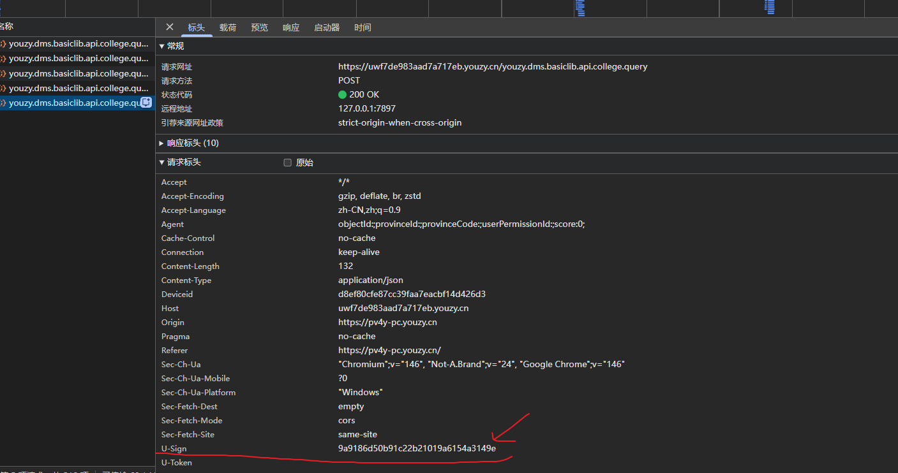
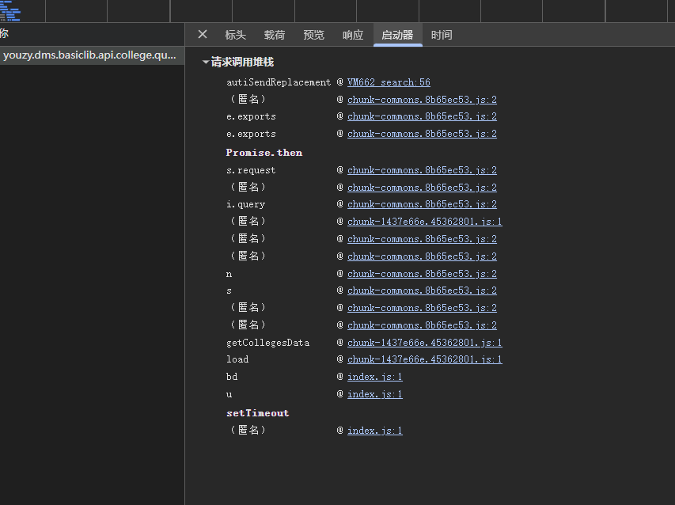
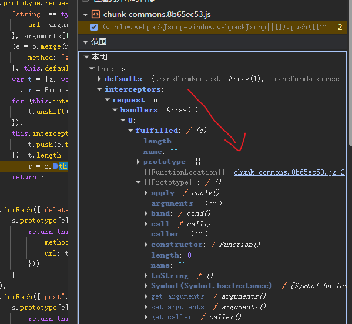
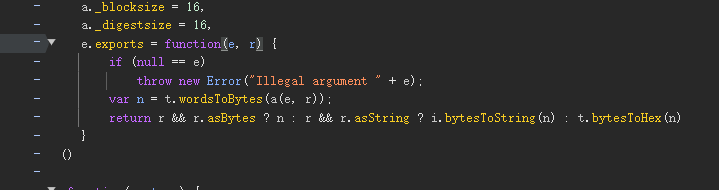

# 某高校数据查询平台 U-Sign 参数逆向分析

## 1. 架构引言：前端工程化与发包层拦截机制

在现代前后端分离架构（如 Vue + Spring Boot）中，网络请求往往不会直接调用原生的 `XMLHttpRequest` 或 `Fetch`，而是通过诸如 `Axios` 等 HTTP 客户端进行高度封装。这种工程化实践在提升开发效率的同时，也为前端安全防护（如动态签名校验）提供了天然的温床。

### 1.1 防护架构分析：请求拦截器 (Request Interceptor)
为了保证每个发出的请求都携带合法的签名（Sign），开发者通常不会在每个具体的业务组件中手写签名逻辑，而是利用类似 Spring Boot 过滤器的机制——**Axios 请求拦截器**。在请求真正触达浏览器底层网络 API 之前，拦截器会统一拦截配置对象，计算签名，并将其塞入 HTTP Headers（如 `U-Sign`）或 URL 参数中。

### 1.2 核心痛点：Webpack 打包与异步断层
当我们试图逆向寻找签名的生成位置时，会面临两个巨大的阻碍：
1. **代码压缩与混淆：** 经过 Webpack 等打包工具处理后，原本模块化的代码会被拼接成几万行的单文件（Chunk）。常规的“全局搜索关键字”往往会定位到形如 `2:36023` 这种超长单行代码中，导致浏览器 DevTools 无法精准打下断点。
2. **异步执行栈：** 请求的触发是由用户交互（如点击按钮）发起的，中间经历了 Promise 链的异步调度。如果直接在网络层下断点，调用栈（Call Stack）的底部往往只能看到异步的上下文，丢失了真正的业务触发源头。

### 1.3 核心战术：Initiator 溯源与 Scope 变量穿透
针对发包层的防护，我们的核心战术是**“顺藤摸瓜”**：
* 抛弃全局搜索，转向利用 DevTools Network 面板的 **Initiator (启动器)**。它记录了请求被调用的完整链路。
* 面对异步断层，我们不只看调用栈，而是重点关注 **Scope (作用域)** 面板。通过观察外层闭包（Closure）中挂载的 `interceptors` 对象，我们能够跨越框架的封装，直接空降到执行签名计算的核心函数现场。

### 1.4 底层原理解析：Promise 异步断层与 Axios 洋葱模型
在实战溯源之前，我们必须弄清导致我们“找不到代码”的底层 JS 运行机制：

* **Axios 拦截器的“洋葱模型”：** Axios 内部将所有的请求拦截器和响应拦截器构建成了一个超长的 `Promise` 链。你的请求配置对象（包含 URL、Data 等）就像穿过洋葱一样，逐层经过你的拦截器（在这个过程中被动态打上 `U-Sign` 签名），最后才被传递给底层的 `dispatchRequest` 发送到网络。
  
* **Event Loop 与 Promise 异步断层：** 
  当代码在执行拦截器链的 `Promise.then()` 时，回调函数会被 JavaScript 引擎（如 V8）推入**微任务队列 (Microtask Queue)**。当主线程清空后，再去执行这些微任务。
  **致命影响：** 这种机制会导致原有的“同步调用栈”被彻底切断。这就是为什么当我们在底层网络 API (如 `XMLHttpRequest.send`) 处打断点时，往回看调用栈，只能看到一堆底层的异步调度器，而根本看不到最初是哪个业务函数发起的请求，也看不到签名在哪一步生成的。理解了这一点，你才会明白为什么我们必须依赖 `Initiator` 或 `Scope` 面板来跨越这个异步断层。

## 1. 目标接口与抓包分析

* **目标接口:** `/search/colleges/collegeList`
* **请求方式:** `POST`
* **加密特征:** 请求头中包含动态签名字段 `U-Sign`，如果不带或错误，接口返回拦截提示。

## 2. 逆向定位过程

### 2.1 尝试全局搜索（踩坑）
初步尝试全局搜索 `"u-sign"` 关键字，成功定位到目标 JS 文件。但由于 Webpack 打包导致单行代码过长，断点落在 `2:36023` 处无法正常断住，此路不通。

### 2.2 追溯调用堆栈 (Call Stack)

转换思路，从 Network 面板的 Initiator 入手。发现堆栈中存在 `Promise.then` 异步断层。

通过在 `s.request` 和底层 `e.exports` 之间下断点观察 Scope (作用域)，确认签名的生成发生在 Axios 的请求拦截器中。

### 2.3 深入请求拦截器

展开 `s.request` 断点处的 `interceptors.request.handlers`，跳转至 `fulfilled` 函数，成功捕获到核心加密逻辑入口：
`"u-sign": i(e.url, e.data)`

## 3. 加密算法破解

单步进入 `i` 函数，提取出底层的拼接逻辑和加密算法：

        e.exports = function(e, t) {
            var r, o = "YOUR_SALT_HERE_***", i = "", a = t || {}, s = (e = e || "").split("?");//# 声明：盐值出于安全合规考虑已脱敏，请通过学习 README 中的逆向思路自行获取
            if (s.length > 0 && (r = s[1]),
            r) {
                var u = r.split("&")
                  , c = "";
                u.forEach(function(e) {
                    var t = e.split("=");
                    c += "".concat(t[0], "=").concat(encodeURI(t[1]), "&")
                }),
                i = "".concat(_.trimEnd(c, "&"), "&").concat(o)
            } else
                i = Object.keys(a).length > 0 ? "".concat(JSON.stringify(a), "&").concat(o) : "&".concat(o);
            return i = i.toLowerCase(),
            n(i)
        }
1.  **盐值发现:** 代码内部硬编码了一个固定盐值 `YOUR_SALT_HERE_***`。
2.  **明文拼接:** 将请求体的 JSON 对象转化为字符串，拼接 `&` 和盐值，最后全部转为小写。
3.  **算法确认:** 进入n函数内部出现 `_digestsize = 16` 等特征，提取明文通过在线 MD5 工具比对，确认结果与抓包一致，为**标准 MD5**，无魔改。

## 4. Python 还原代码
    请参考 ../../02_实战代码/case1_sign.py
