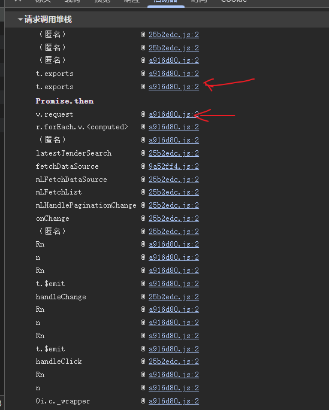
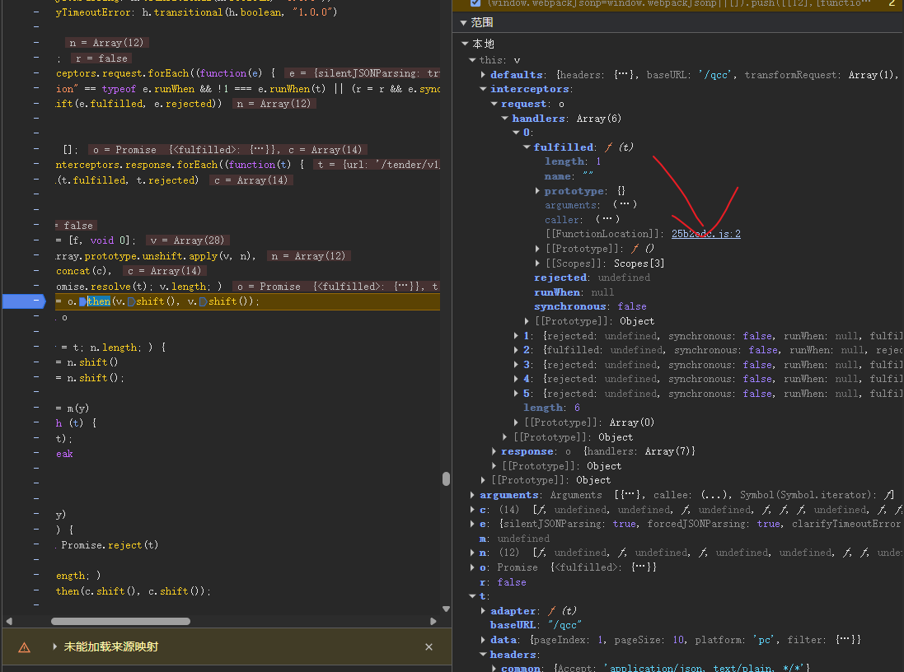

# 某查查旗下平台 参数逆向分析

## 1. 架构引言：前端工程化与发包层拦截机制

在现代前后端分离架构（如 Vue + Spring Boot）中，网络请求往往不会直接调用原生的 XMLHttpRequest 或 Fetch，而是通过诸如 Axios 等 HTTP 客户端进行高度封装。这种工程化实践在提升开发效率的同时，也为前端安全防护（如动态签名校验）提供了天然的温床。

### 1.1 防护架构分析：请求拦截器 (Request Interceptor)

为了保证每个发出的请求都携带合法的签名（Sign），开发者通常不会在每个具体的业务组件中手写签名逻辑，而是利用类似 Spring Boot 过滤器的机制——Axios 请求拦截器。在请求真正触达浏览器底层网络 API 之前，拦截器会统一拦截配置对象，计算签名，并将其塞入 HTTP Headers（如 X-Kzz-Request-Key）中。

### 1.2 核心痛点：Webpack 打包与异步断层

当我们试图逆向寻找签名的生成位置时，会面临两个巨大的阻碍：

代码压缩与混淆： 经过 Webpack 等打包工具处理后，原本模块化的代码会被拼接成几万行的单文件（Chunk）。代码往往被挤压在第 2 行，导致断点落在形如 2:1745895 这种超长单行代码中，浏览器 DevTools 极易发生断点漂移或无法正常断住。

异步执行栈： 请求的触发是由用户交互发起的，中间经历了 Promise 链的异步调度。如果直接在网络层下断点，调用栈（Call Stack）的底部往往只能看到异步的上下文，丢失了真正的业务触发源头。

### 1.3 核心战术：调用栈溯源与 Scope 变量穿透

针对发包层的防护，我们的核心战术是**“顺藤摸瓜”**：

通过 XHR 断点拦截发出的请求，观察右侧的请求调用堆栈 (Call Stack)。

面对底层 Promise 的异步断层，我们不在此盲目单步调试，而是重点关注 Scope (作用域) 面板。通过展开闭包中挂载的 interceptors.request.handlers 对象，直接提取 [[FunctionLocation]]，跨越框架的封装，空降到执行签名计算的核心函数现场。

### 1.4 底层原理解析：Promise 异步断层与 Axios 洋葱模型

Axios 拦截器的“洋葱模型”： 所有的请求/响应拦截器被构建成了一个超长的 Promise 链。请求配置对象在穿过洋葱的过程中，被动态注入加密 Headers，最后才传递给底层网络调度器。

Event Loop 与 Promise 异步断层： 执行拦截器链的 Promise.then() 时，回调会被推入微任务队列 (Microtask Queue)。这导致同步调用栈被彻底切断。因此，在底层 API 往回看调用栈，只能看到底层调度器，必须依赖 Scope 面板的变量引用来完成“时空跃迁”。

## 2. 目标接口与抓包分析

目标接口: /qcc/tender/v1/newlatest/search

请求方式: POST

加密特征: 请求头中包含四个高度相关的动态字段：X-Kzz-Request-From、X-Kzz-Request-Id、X-Kzz-Request-Time、X-Kzz-Request-Key。

业务风控: 接口存在严格的身份校验，不带或错误 Cookie（如 QCCSESSID 和 tqcc_did）会触发 429 Too Many Requests，非标准版会员拉取过量数据会触发 403 Limitation。

## 3. 逆向定位过程

### 3.1 尝试空降与突破底层调度栈

通过 XHR 断点拦截发出的请求，发现栈顶停留在 a916d80.js 的底层发包逻辑中。向下回溯调用栈，发现连续经过 Promise.then 的 o = o.then(v.shift(), v.shift())。
此处如果单步执行会陷入 Webpack 的混淆泥潭。经promise上下两个栈的scope分析，加密参数是在进入底层调度之前的请求拦截器中生成的。

### 3.2 作用域穿透：寻找真实的业务入口

在调试器右侧展开本地作用域 (Local Scope)：this -> interceptors -> request -> handlers。
发现 6 个拦截器函数的引用数组。依次展开 fulfilled 属性，找到 [[FunctionLocation]]: 25b2edc.js:2，点击链接直接跳出 Axios 框架，空降至业务注册代码处。

### 3.3 夹逼断点：锁定加密参数赋值位置

依次审查 6 个拦截器函数的内部逻辑，在第 4 个拦截器中发现高度可疑的 Header 修改代码：
n.headers = Ux(Ux({}, n.headers), l)
在此行代码及上一行分别打下断点，放行请求进行“夹逼验证”。观察变量发现，执行该行后 headers 对象中瞬间生成了 X-Kzz-Request-Key 等核心加密参数，成功锁定目标。

## 4. 加密算法破解

在拦截器闭包内部提取出核心参数生成与拼接加密逻辑：

    javascript
    Wx = function(e, t) {
        return function(n) {
            var r = [Zx()(1e7, 99999999), Zx()(1e3, 9999), Zx()(1e3, 9999), Zx()(1e11, 999999999999)].join("-"),
                o = Date.now(),
                l = Gx(Gx(Gx({}, Yx("id"), r), Yx("from"), e), Yx("time"), o);
            return t && Object.assign(l, Gx({}, Yx("key"), ne()(Jx()("".concat(t, ":").concat(e, ":").concat(o, ":").concat(r))))),
            n.headers = Ux(Ux({}, n.headers), l),
            n
        }
    }

1. **盐值发现:** 外部传入的变量 t 为固定盐值 "YOUR_SALT_HERE_***"，e 为固定标识 "qcc-tender-web"。(声明：盐值出于安全合规考虑已脱敏)
2. **动态参数:** o 为 13 位现行时间戳，r 为由四个随机数区间生成的类似 UUID 格式的字符串。
3. **明文拼接:** 核心明文拼接规则为 盐值:平台标识:时间戳:随机ID。
4. **算法确认:** 观察最终生成的 Key 呈现 32 位大写十六进制特征。为避免 Network 面板的时间差污染，直接在断点 Console 控制台中提取拼接完成的明文，通过在线工具比对，确认 ne()(Jx(...)) 为标准 MD5，无任何魔改，可直接使用原生算法还原。

## 4. Python 还原代码
    请参考 ../../02_实战代码/case2_sign.py