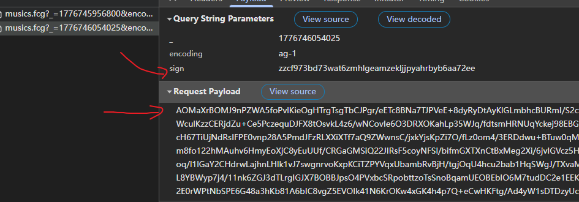
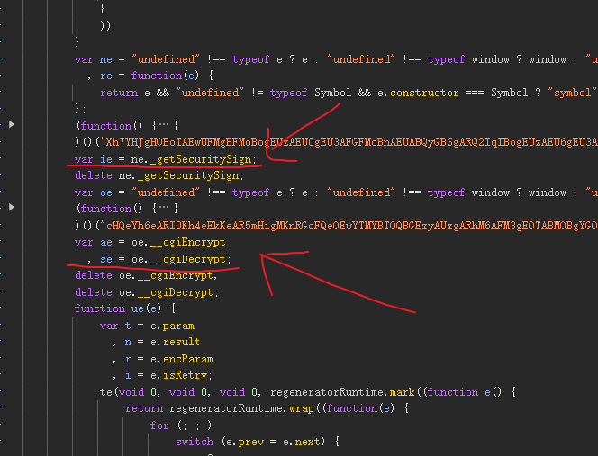
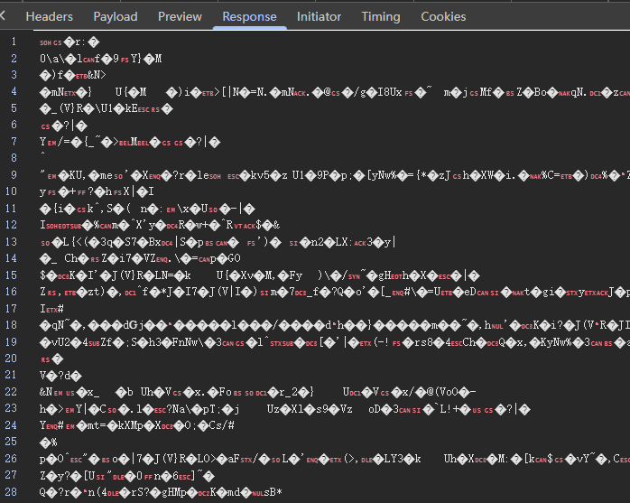
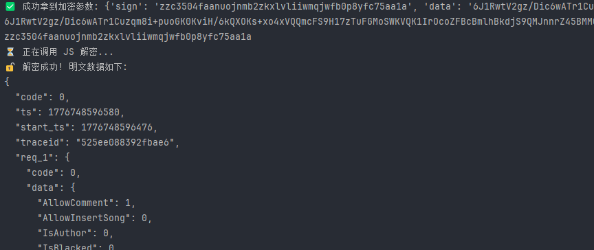

# 📝 实战复盘：QQ音乐 JSVMP 与二进制流解密（webpack）

## 1. 特征分析

**特征**：

- **请求层**：URL 携带动态 `sign` 签名，请求体 Payload 被完全加密。
- **响应层**：返回数据并非标准 JSON，而是二进制乱码流。
- **代码层**：深度 Webpack 模块化构建，核心加解密逻辑被抽离并套上了强混淆与 JSVMP。

## 2. 逆向攻防推演 (全流程拆解)

### 步骤一：数据流拦截与加密入口溯源

**切入点**：发包载荷是一段密文，意味着在发包前必然经过序列化。

**战术**：通过 Hook `JSON.stringify`，在参数被转换为字符串的前一刻触发拦截。

**调用栈回溯**：通过调用堆栈回溯，发现代码被编译为了 `regeneratorRuntime.wrap` 的状态机（用于处理 async/await 异步流）。在 `switch-case` 控制流中，成功锁定了加密参数生成位置：

      return u = ie(r.data),
      n.next = 11,
      ae(r.data);
      case 11:
      r.data = n.sent

- 同步签名计算：`u = ie(r.data)`
- 异步载荷加密：`r.data = n.sent 即(await ae(r.data))`

### 步骤二：JSVMP对抗

- **试错路径 A（Proxy 深度补环境）**  
  将 `ie` 和 `ae` 扣出后本地运行，发现抛出大量 `ReferenceError`。尝试挂载 `Proxy` 代理进行缺啥补啥，却发现陷入了 DOM/BOM 环境体检的“无底洞”，此路不通。

- **试错路径 B（Webpack 全量扣取）**  
  尝试剥离整个 Webpack 加载器，但文件依赖极其庞大，模块作用域隔离严重，难以将动态生成的 VMP 函数暴露给全局。

- **破局点 **  
  放弃静态对抗。利用 `js_vtools` 在浏览器端 `u = ie(r.data)` 断点处直接 **提取当前执行上下文的临时环境**。这相当于做了一次内存 Dump，直接跳过了 VMP 前期的冗长环境检测阶段，拿到一个纯净可调用的黑盒基座。

### 步骤三：二进制流响应体解密

**难点**：拿到二进制密文后，需要调回 JS 环境的 `se()` 函数。但由于前期补环境脚本污染了 Node.js 的原生对象，导致传入二进制流时频繁报错。

**破局战术（IPC 通信与类型转换）**：

- **避开命令行长度限制**：放弃 `sys.argv` 传参，改用 `fs.readFileSync(0, 'utf-8')` 通过标准输入流 (stdin) 接收 Python 灌入的海量密文数据。
- **打破环境污染**：Python 端将 `bytes` 转换为纯数字数组字符串 `"[123, 45, 255...]"`。Node.js 端解析 JSON 后，使用最原生的 `new Uint8Array(byteArray)` 重新包裹。这一步物理切断了补环境框架对 `Buffer` 或 `ArrayBuffer` 原型链的干扰，成功触发原生 `se()` 解密逻辑。

## 3. 总结经验

### 认知升级 1：不要和 JSVMP 硬刚

JSVMP 的本质是将代码逻辑转为自定义的字节码，并在模拟的堆栈引擎中执行。面对成熟的 VMP，通过 `Proxy` 补环境往往会触发其内部埋设的无数个校验分支。利用 `js_vtools` 这类工具，通过断住加密发生前，生成用于vmp环境检测的临时环境。

### 认知升级 2：识别异步控制流平坦化

当你看到 `regeneratorRuntime.mark` 和 `switch (n.prev = n.next)` 时，不要慌张。这是 Webpack 打包时为了兼容低版本浏览器，将 `async/await` 语法强行转译成了状态机。遇到这种代码，核心关注 `n.next = xxx` 以及 `n.sent`（代表 await 返回的结果）。

### 认知升级 3：跨语言二进制传输解密

在 Python 与 Node.js 之间进行 RPC 或子进程通信时，传输密文二进制流不能直接传 Base64（容易有编码隐患）或原生 Buffer。  
**实践**：Python 将 `bytes` 转为 `List[int]`，通过 JSON 序列化传给 Node.js，Node.js 接收后直接 `new Uint8Array(array)`。解决了补环境框架带来的底层类型污染。